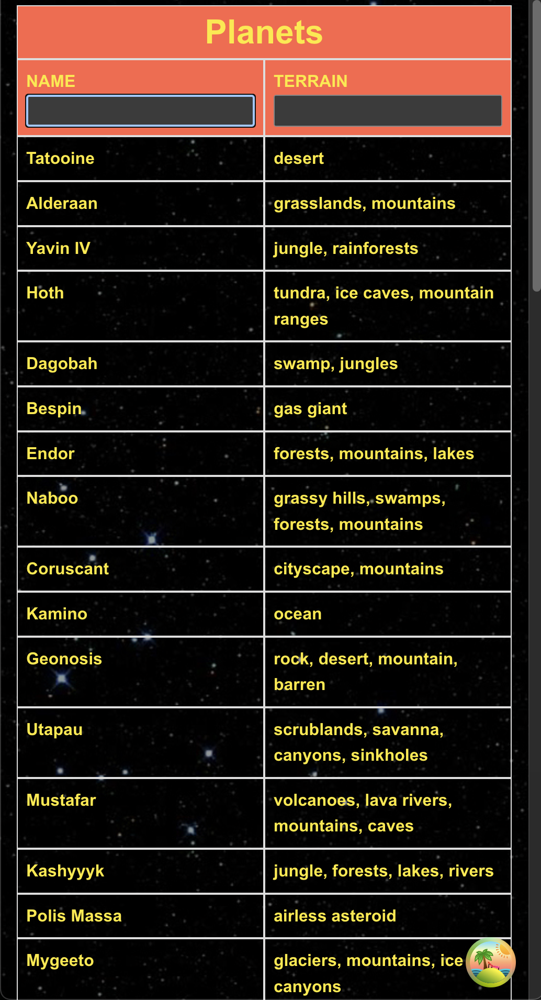

## Step By Step To Run
1. Install dependencies with npm install.
2. Start the application using npm start.
3. Open http://localhost:3000 in your browser to test the app.

## Flexible requirements: 
1. Add additional controls to filter the planets by terrain and climate.
2. Create the UI from scratch without using any UI component libraries.

## Other call outs
1. Min screen width supported: 320px
2. Real time exchange currency information for each transaction is displayed upon hover on transaction row, amount column.
Reason for that: since transactions table can be extensive, the ad-hoc mechanism makes it lighter to visualize each transaction by each currency, instead of having a logic to run every X seconds for every row element.
3. When shrinking screen, non-vital table information is hidden in order to content be better displayed.

## Screenshots

### Planets Table

Planet Details:

### Medium Screens

Hovering: 

Filtering: 

### Small Screens

Filtering: 

Planet Details

Filtering: 

Hovering: 
